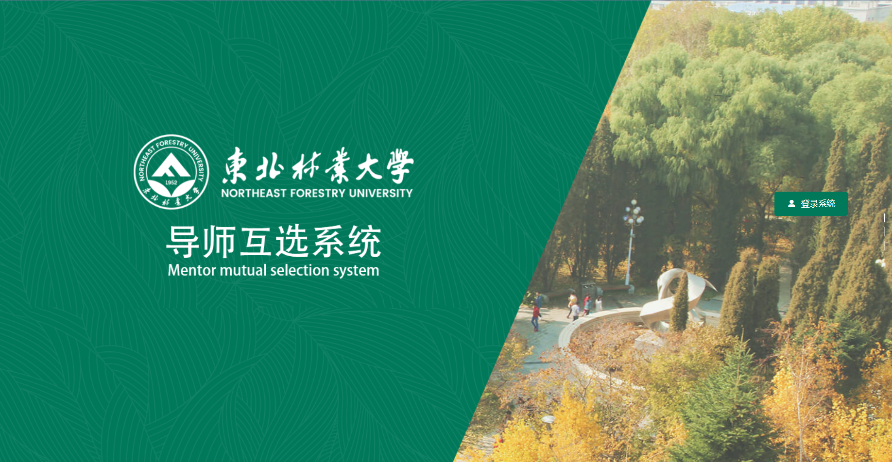
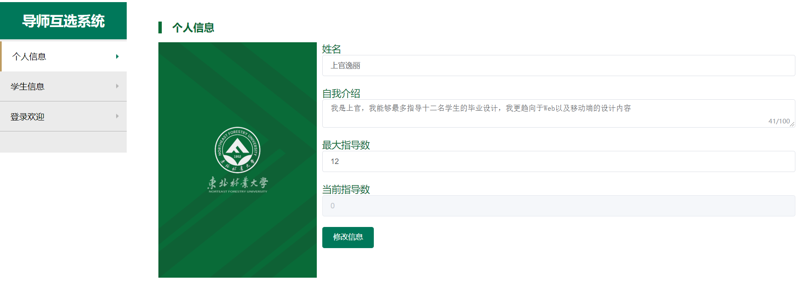

# Person-vue

 东北林业大学 Web系统框架课程  导师选择系统 demo 


> ps. 自己真的做的很差劲，很多地方缺漏很多，算是学习的过程。后端写的也支离破碎，希望能够通过这个小项目学习一些知识。
>
> [:runner:后端](https://github.com/BakaRice/PersonnelManagementSystem)

```json
"dependencies": {
    "axios": "^0.19.2",
    "axios-mock-adapter": "^1.18.1",
    "core-js": "^3.6.4",
    "element-ui": "^2.13.2",
    "vue": "^2.6.11",
    "vue-router": "^3.1.6",
    "vuex": "^3.1.3"
  },
```

1. 全部素材来自学校，版权为东北林业大学所有，仅供学习
2. 使用`element-ui`,主题颜色为东北林业大学官方色 `#00785A`

#### 登录首页



#### 导师个人信息修改界面




### tips：

1. input v-model 和计算属性的双向绑定 需要加set方法 

   https://vuex.vuejs.org/zh/guide/forms.html

2. 声明独立的component，alertdialog

   

   


